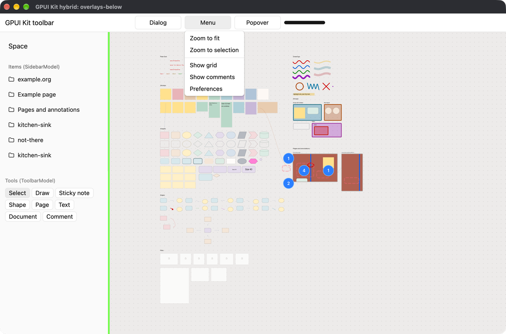
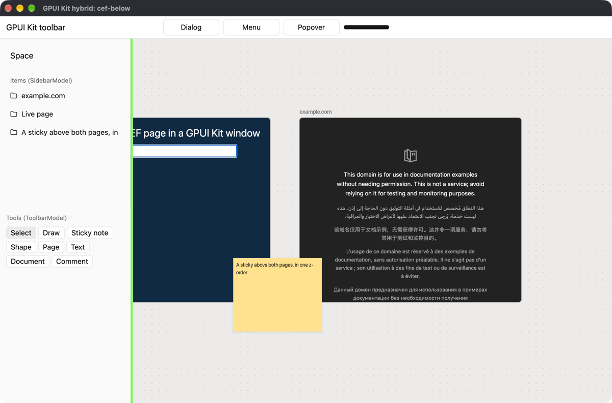

# ADR 0040 — GPUI Kit as the shell around our own canvas view

**Status:** Accepted for the shell, on the user's choice of GPUI Kit for the UI around the canvas. Built as `native/crates/specular-shell` (binary `specular`) beside the winit shell, which stays until parity. Measured on one machine with scripted input. The "Needs a human at a Mac" list is what is still unchecked.
**Date:** 2026-10-07
**Related:** [ADR 0039](./0039-rust-canvas-render-stack.md), which turned GPUI down as the renderer of pages and canvas items. This ADR tests a different arrangement and does not reverse that finding. [Rust native rebuild plan](../plans/rust-native-rebuild.md).
**Code:** `native/bakeoff/gpui-kit-hybrid/`, a standalone cargo workspace outside `native/Cargo.toml`. Reports and captures are in its `shots/`. `scripts/run-all.sh` reproduces all of it.

## Verdict

**Works, with named caveats.**

One GPUI window, GPUI Kit 0.7.1 drawing the toolbar, sidebar, menus and dialogs, and our unchanged `specular-compositor` drawing the canvas and its CEF pages into a child `NSView` of that window. Both hold 120 Hz. Real CEF pages arrive zero-copy and take keys and input-method composition.

The caveats:

1. **The canvas view must sit below GPUI's view.** Above it, every popover, menu and dialog is hidden behind the canvas, and a resize shows a one-frame gap. Below it, none of that happens. Below costs a transparent GPUI window and one line to clear the Kit root's background.
2. **GPUI's key events still carry no key code.** A page needs the raw `NSEvent`. An app-local event monitor supplies it, tested end to end into a CEF text field.
3. **Canvas-anchored UI stays in our wgpu pass.** GPUI draws in its own layer on its own frame, so anything that must follow an entity during a pan belongs with the canvas.
4. **The dependency is one maintainer's weekly snapshot of Zed's GPUI.** See Risks.

What ADR 0039 found is still true: GPUI cannot draw the pages. Here it never tries to.

## How it is arranged

```
NSWindow (GPUI's)
└─ contentView
   ├─ SpikeCanvasView   ours, layer-hosting a CAMetalLayer, wgpu 30 surface, fills the window
   └─ GPUIView          GPUI's Metal layer, non-opaque, drawn above
```

GPUI adds its own view as a subview of the window's content view (`gpui-pre-macos` `window.rs:1196`), so a sibling can go under it with `addSubview:positioned:relativeTo:`. `Window` implements `raw_window_handle::HasWindowHandle` and hands back that `NSView`. The surface comes from `wgpu::SurfaceTargetUnsafe::CoreAnimationLayer`.

The canvas view never moves. GPUI leaves the canvas slot unpainted, and the hole in its layer is where the canvas shows. The slot is an ordinary GPUI element, so it takes part in layout, hit-testing and focus like any other.

GPUI Kit's own `crates/webview` hosts a native child differently. It reads the element's bounds in `prepaint`, calls `setFrame` on a wry `WKWebView`, and inserts a `BlockMouse` hitbox. On the repository's main branch it reparents the webview into a "window composition surface", an API that exists only in GPUI Fast, Longbridge's own GPUI fork (first published 2026-10-06). That crate is not on crates.io and is not part of 0.7.1. We need none of it.

## 1. Build and frame pacing

gpui-kit 0.7.1 on gpui-pre 0.3.8, wgpu 30.0.1, our six crates by path and cef 154 build into one binary with no patches. The lockfile has 915 packages against 496 for `native/`. GPUI brings the old `objc` and `cocoa` crates next to the `objc2` ones we use. They coexist.

Frame intervals over 8 seconds on a 120 Hz built-in display (M3 Max), kitchen-sink canvas, synthetic pages. "Late" is an interval over 1.5 frames. "Link" means the canvas draws from its own display link. "GPUI" means it draws from the slot element's paint, once per GPUI frame.

| Layering | Canvas driven by | GPUI redrawing every frame | Canvas fps, p99 ms, late | GPUI fps, p99 ms, late |
|---|---|---|---|---|
| below | link | no | 120.0, 11.06, 0 | idle |
| below | link | yes | 120.0, 10.25, 0 | 120.0, 9.34, 0 |
| below | GPUI | no | 119.9, 9.11, 1 | same frame |
| below | GPUI | yes | 119.9, 8.99, 1 | 119.9, 9.04, 1 |
| above | link | no | 119.6, 10.83, 4 | idle |
| above | link | yes | 119.9, 10.86, 1 | 119.9, 9.32, 1 |
| above | GPUI | no | 120.0, 9.16, 0 | same frame |
| above | GPUI | yes | 120.0, 9.32, 0 | 120.0, 9.32, 0 |

With real CEF pages (one animating, one static, both IOSurface frames imported zero-copy):

| Run | Canvas | GPUI |
|---|---|---|
| CEF, GPUI idle | 120.0 fps, p99 8.62 ms, 0 late of 966 | idle |
| CEF pumped from GPUI's executor | 119.8 fps, p99 8.84 ms, 2 late of 958 | idle |
| CEF, GPUI redrawing every frame | 120.0 fps, p99 8.56 ms, 0 late of 990 | 120.0 fps, 0 late |
| CEF, canvas drawn from GPUI's frame | 120.0 fps, p99 8.87 ms, 0 late of 1002 | 120.0 fps, 0 late |

These are CPU-side timestamps taken after `present`, not presented times from the display. One earlier CEF run with GPUI redrawing showed 36 late frames of 949. Three repeats showed none, so I read it as noise, but it happened.

The transparent GPUI layer over the canvas costs nothing I could measure. `top` showed WindowServer at 49 to 52 percent in both layerings on a busy desktop.

Everything runs on the main thread: GPUI's frame, our frame and CEF's pump. That is the same as the winit shell today.

## 2. Layering

| | Canvas below GPUI | Canvas above GPUI | Above, clicks passed through |
|---|---|---|---|
| Dropdown menu | over the canvas | hidden | hidden |
| Popover | over the canvas, shadow blends | hidden | hidden |
| Context menu | opens over the canvas | never opens | opens, hidden |
| Dialog and scrim | over the canvas | hidden | hidden |
| Who gets a click on the canvas | GPUI | the native view | GPUI |
| Escape after a click on the canvas | reaches GPUI | goes to the native view | reaches GPUI |

Below: [dropdown](../../native/bakeoff/gpui-kit-hybrid/shots/overlays-below-dropdown.png), [popover](../../native/bakeoff/gpui-kit-hybrid/shots/overlays-below-popover.png), [context menu](../../native/bakeoff/gpui-kit-hybrid/shots/overlays-below-context-menu.png), [dialog](../../native/bakeoff/gpui-kit-hybrid/shots/overlays-below-dialog.png).
Above: [dropdown hidden but for a sliver](../../native/bakeoff/gpui-kit-hybrid/shots/overlays-above-dropdown.png), [dialog open and invisible](../../native/bakeoff/gpui-kit-hybrid/shots/overlays-above-dialog.png), [context menu opened under the canvas](../../native/bakeoff/gpui-kit-hybrid/shots/overlays-above-through-context-menu.png).



Above is the airspace problem, and it breaks more than drawing. The native view becomes first responder on a click, so Escape no longer closes a GPUI menu. The Kit's resize handle is a band centered on the divider, and the half on the canvas side is dead because the native view takes the press. A press on that half moved nothing (`shots/resize-above-grab-on-divider.txt`).

Below needs two things. The window opens with `WindowBackgroundAppearance::Transparent`, which makes GPUI's Metal layer non-opaque. And the Kit's `Root` paints the theme background over the whole window through a root plugin, which hides the canvas until the root's own style clears it (`Root::new(..).bg(transparent_black())`). That means opening the window with `cx.open_window` instead of `gpui_kit::open_window`. It is a supported path, since `Root` is `Styled`, but it is the one place the Kit assumed it owns every pixel.

With a dialog open, a click on the canvas reached nothing behind the scrim. With a dropdown open, the click closed the menu and also reached the canvas slot. That is the Kit's own menu behavior and would need a guard if we do not want a dismissing click to start a gesture.

The Kit also has `native_menu`, an `NSMenu` popup. It would sit above any native view, but nothing here needs it.

## 3. Resize and layout lockstep

The script drags the Kit's resize handle 240 points out and back at 6 points a frame, then resizes the window, and captures throughout. GPUI paints a green stripe on the sidebar's edge and, in the above layering, magenta under the canvas view. `scripts/lockstep-scan.py` reads one pixel row of each capture.

| | Captures | Disagreement |
|---|---|---|
| Below, sidebar drag and window resize | 27 | none in any capture |
| Above, sidebar growing | 6 | a magenta gap of 11 to 13 device pixels beside the stripe in 5, which is one drag step, and 2 pixels in the sixth |
| Above, sidebar shrinking | 7 | the stripe is covered in all 7 |
| Above, window resize | 12 | 1 with a 5 pixel gap |

Above, the native view's frame commits with the CoreAnimation transaction and GPUI's Metal drawable presents a frame later, so the canvas view leads GPUI by one frame. Drawing the canvas from GPUI's own frame did not change it. GPUI's renderer only presents with the transaction during a live resize, and that switch is private.

Below has nothing to disagree. The canvas view does not move, and the edge of the canvas is an edge GPUI drew. [Below mid-drag](../../native/bakeoff/gpui-kit-hybrid/shots/resize-below-drag-21.png), [above with the gap](../../native/bakeoff/gpui-kit-hybrid/shots/resize-above-drag-21.png), [above with the stripe covered](../../native/bakeoff/gpui-kit-hybrid/shots/resize-above-drag-63.png).

What the canvas must do below is treat the slot's rect as its viewport. The spike does not: zoom-to-fit centers on the whole window, so content sits partly under the sidebar. The slot's bounds are known in `prepaint`, a frame before they show, so the camera can use them in the same frame.

Reconfiguring the wgpu surface cost 0.3 to 0.9 ms each time. Below reconfigures only when the window changes size, 58 times in the run. Above reconfigures on every sidebar step as well, 177 times.

Not tested: a live window resize by hand. The script resizes with `setFrame:display:`, which does not put GPUI into its present-with-transaction path.

## 4. Input

Every event was synthesized inside the process and logged at three places: an app-local `NSEvent` monitor, GPUI's handlers on the slot element, and GPUI's `EntityInputHandler`. Full log in `shots/input-below.txt`.

| Event | GPUI gives the slot | Enough for our `Event` | Enough for a CEF page |
|---|---|---|---|
| Pointer press, drag, release | position, button, click count, modifiers | yes | yes |
| Right click | `MouseButton::Right` | yes | yes |
| Scroll | pixel deltas, a touch phase, modifiers | yes | yes, but no momentum phase |
| Pinch | delta and phase (started, moved, ended) | yes | n/a |
| Key down and up | key name, `key_char`, modifiers, `is_held` for repeat | yes | **no** |
| Modifier change | the new modifier set | yes | yes |
| Marked text and commit | text, selection range, replacement range, candidate bounds asked back | yes | yes |

ADR 0039 was right about keys, and gpui-pre 0.3.8 has not changed it. `Keystroke` is `modifiers`, `key` and `key_char`. Numpad 1 (key code 83) and digit 1 (key code 18) both arrive as `key="1"`. GPUI reads `keyCode` internally to work out characters and drops it.

The local monitor fills the gap. `+[NSEvent addLocalMonitorForEventsMatchingMask:handler:]` sees each key event before GPUI does, with `keyCode`, raw modifier flags, `isARepeat`, `characters` and `charactersIgnoringModifiers`. That is everything `specular_core::KeyEvent` needs. The spike builds CEF's `RawDown`, `Char` and `Up` from it and types into a page. A subclass of the child view is not needed and would not work below, where the view never becomes first responder.

IME goes through GPUI. The slot registers an `ElementInputHandler`, and GPUI's `NSTextInputClient` calls it with marked text and ranges. The spike forwards those as `ImeEvent::SetComposition` and `ImeEvent::Commit`. A dead key through the system input context (Option+E) arrived as marked text `´`.



The page's field reads `hi にほ` with the composition marked, then [`hi 日本` after the commit](../../native/bakeoff/gpui-kit-hybrid/shots/cef-below-typed.png). The letters went through the monitor, the composition through GPUI.

Two things to know. A key GPUI binds to an action is still seen by the monitor first, so an entered page can be given the key and GPUI denied it by returning nil from the monitor. And synthesized scroll, pinch and right-click events reach the process with no window, so the script routes them to the view under the point by hand. GPUI's own translation of the real `NSEvent` did run. AppKit's routing of those three is the untested step.

## 5. CEF

It ran unchanged. `CefPageSource::new` calls `app_protocol::install`, which adds `isHandlingSendEvent` and `setHandlingSendEvent:` and the three protocols to whatever class `NSApp` is. Under GPUI that class is `GPUIApplication`, and the install passed its own checks. Call it inside `Application::run`'s callback, where `NSApp` exists.

The message pump works both ways:

- **Run-loop timer** (`Pump::RunLoopTimer`, as the winit shell uses). A `CFRunLoopTimer` on the main loop does not care who owns the loop. 966 frames, none late.
- **GPUI's foreground executor** (`Pump::Caller`, a `cx.spawn` loop on a 4 ms timer). It works: 958 frames, 2 late. GPUI's timers fire on a global dispatch queue and hop to the main queue, so a 4 ms timer came back at a mean of 5.5 ms, p99 8.3 ms. Keep the run-loop timer.

Pages: a `data:` page with a CSS animation and `https://example.com/`. Their IOSurfaces went through `Compositor::handle_page_event` and drew in one z-order with a sticky note above both (843 page frames in 8 s, all zero-copy). Shutdown through `poll_shutdown` from a GPUI task was clean. The bundle is the same layout as `bundle-macos.sh`, in `scripts/bundle.sh`.

Not tested: 40 pages, popups such as `<select>`, devtools, and the sandbox.

## 6. What this changes in our architecture

**Replaced.**

- `specular-app`'s winit shell: the event loop, the window, `app/input.rs` and `translate.rs`. GPUI owns `NSApplication`, so winit goes. The key-code tables in `translate.rs` stay, fed from `NSEvent` instead of winit.
- The muda menu bar in `app/menu_bar/`. GPUI has its own application menus and key bindings (`cx.set_menus`, actions). Not exercised here.
- The built-in panel renderer: `specular-interact/src/panel/builtin*`, `specular-scene/src/panel*` and `draw_panels`, `Session.panel`, `Event::BuiltinPanels`, `Hit::Panel`. The list the run log already gives for "a UI library replaces".
- The egui panels pass ADR 0039 chose, which was never built.

**Kept.**

- `specular-doc`, `specular-interact`'s `update`, `specular-scene`'s `view`, `specular-compositor`, `specular-cef`, `specular-api`. The spike links the first five unchanged.
- The pure models. `toolbar(&App)` and `sidebar(&App)` drove GPUI Kit `Button`s and `SidebarMenuItem`s directly: each control's label and `active` or `selected` flag set the component, and a click sent the control's own `Action` through `update`. No adapter layer was needed. [The Kit sidebar built from `SidebarModel`, the Kit tool buttons from `ToolbarModel`](../../native/bakeoff/gpui-kit-hybrid/shots/model-below-tool-armed.png). `Dropdown`, `Swatches`, `Toggle` and `Stepper` were not mapped. The Kit has a dropdown menu, a color picker, a switch and a number input to map them to.

**Canvas-anchored UI stays in our wgpu pass.** Selection handles, the item popup that follows an entity, page chrome, comment pins, the marquee. GPUI could draw a popover at a canvas position, and it would be right at rest. During a pan it would be wrong by up to a frame, because GPUI lays out and presents in its own layer on its own frame, and section 3 shows what that looks like at an edge. In the capture above, the handles on the selected page and the sticky tool's popup are ours, drawn in the canvas pass, while the sidebar and buttons are the Kit's.

So `PopupAnchor` is the dividing line. `PopupAnchor::Canvas` popups keep a renderer in the scene. `PopupAnchor::Toolbar` popups and the toolbar itself can be Kit components. That means the built-in renderer does not go away entirely: the part that draws a popup's controls beside an entity stays, or the item popup is redesigned to dock.

The shell also changes shape. Today `specular-app` owns the loop and calls `update` on each winit event. Under GPUI the `App` lives in a GPUI entity or beside one, GPUI views read the models during `render`, and something must tell GPUI to re-render when `update` changes the app. The spike does this with `cx.notify()` after each action and reads the models on every render.

## 7. Risks

**Who publishes it.** `gpui-pre`, `gpui-kit`, `gpui-component` and `gpui-fast` have one crates.io owner, `huacnlee` (Jason Lee, Longbridge). `gpui-pre` is an automated snapshot of `zed-industries/zed`'s `crates/gpui*`, not a fork: its manifest still names Nathan Sobo and the Zed repository. Zed's own `gpui` on crates.io is 0.2.2 from 2025-10-22 and has not moved.

**How often.** `gpui-pre` first appeared 2026-09-03 and has shipped every Monday since: 0.3.4 through 0.3.8 on 09-07, 09-14, 09-21, 09-28, 10-05. `gpui-kit` ships the same day, pinned to that snapshot with `=`. The Kit's repository is busy and Longbridge ships a commercial desktop app on it.

**What a breaking change costs.** The pin means nothing moves until we move it. Any snapshot may change GPUI's API. The Kit switched to exact pins after a caret requirement broke applications (their issue 3156), and one Kit release, 0.6.5, was yanked. Our exposure is small and specific:

- The public element API the slot uses (`canvas`, `insert_hitbox`, `on_mouse_event`, `handle_input`, `EntityInputHandler`). Upstream Zed uses all of it, so it is stable in practice.
- Three facts about GPUI's macOS backend that no API promises: its view is a subview of the content view, a transparent window makes its layer non-opaque, and `window_handle` returns that view. If any changes, the canvas stops showing. That would cost a day to diagnose and fix, and it would be found on the first launch after a bump.
- The Kit root's background fill, cleared by style.

We would hold a pin for months at a time and take a new one on purpose.

**The fork in the road.** GPUI Fast is two days old, and the Kit's main branch already makes its webview crate depend on it. If the Kit's attention moves to Fast, the `gpui-pre` path may get less care. We do not need Fast today.

**Single maintainer, young crate names.** If the snapshots stop, the fallback is to vendor the last one. It is Apache-2.0 and GPL-free (Zed's editor is separate and not included).

**Weight.** 419 more packages in the lockfile and a 51 MB debug binary. GPUI's text stack, its own Metal renderer and its executor all come along while we keep ours.

**Platform.** This is macOS only. On Linux GPUI renders with its own wgpu 29 and on Windows with DirectX. A child-surface arrangement there is a separate piece of work.

## What I would do

Adopt this only if the Kit's components are worth more than building panels in our own pass, which is the question ADR 0039 answered with egui and never tested in use. The spike removes the technical objections to the hybrid. It does not show the Kit is the better choice, only that it is an available one. If the next step is taken, it is a real shell behind a flag: the canvas slot, the monitor for keys, the toolbar and sidebar from the models, and a day of use by hand.

## Needs a human at a Mac

The real shell was driven by scripted `NSEvent`s posted to the app's own queue. That covers clicks, keys into the canvas and into a CEF field, the Kit's popovers and dialog over the canvas, and frame pacing. It does not cover anything a hand or a second display does.

- Resize the window by dragging its edge. GPUI presents with the transaction during a live resize and our layer does not. The canvas view no longer moves, so the risk is a stretched frame, not a gap.
- A real trackpad: scroll with momentum, pinch, and a two-finger pan over the canvas while a Kit popover is open. Scroll and pinch reach the slot through GPUI's handlers and were never sent by script.
- A real input method (Japanese or Pinyin) typing into a CEF field and into a canvas text item, and the candidate window's position. Plain keys go to the canvas as keys and composition through GPUI's input handler. Which of the two the first key of a composition takes was not seen.
- Cmd+Z, Cmd+C and Tab with a page entered. They go to `update` as keys and the binding table decides. Check that it feels right, and that a menu shortcut does not also fire.
- The menu bar: every item's shortcut shows, a chosen item runs once, and what a disabled item looks like. AppKit asks GPUI whether the action is available, and all model items share one action type, so they are probably never greyed.
- Backspace in a page field. One scripted run removed two characters.
- Dropping files from Finder onto the canvas, and where they land.
- VoiceOver. GPUI has accesskit, and our canvas view exposes nothing.
- Full screen, a second display at 60 Hz, and moving the window between displays of different scale.
- 40 CEF pages with the Kit's panels open.
- The traffic lights sit in the toolbar's left padding and the strip is 44 px tall. Check that the window drags by the toolbar and that double-click zooms.
