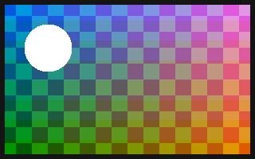

# Kitchen sink

A paragraph with **bold**, *italic*, ~~struck~~, `inline code` and a
[link](https://example.com). It is long enough to wrap in the card.

## Lists

- First item
- Second item with **bold**
  - Nested item
  - Another nested item
- Third item

1. One
2. Two
3. Three

- [ ] An open task
- [x] A finished task

### A table

| Kind    | Count | Notes          |
| ------- | ----- | -------------- |
| Sticky  | 14    | every colour   |
| Shape   | 60    | ten kinds      |
| Drawing | 12    | pen, highlight |

#### Code

```rust
fn main() {
    println!("hello, canvas");
}
```

> A block quote, with a second sentence so that it wraps onto another line.

---



The end.
